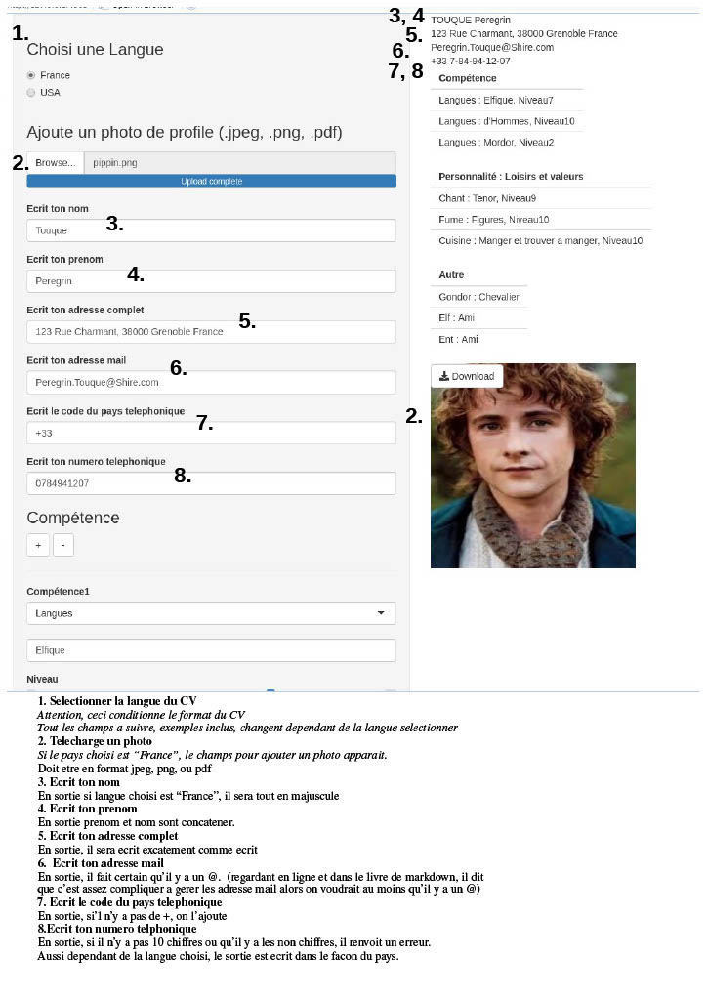
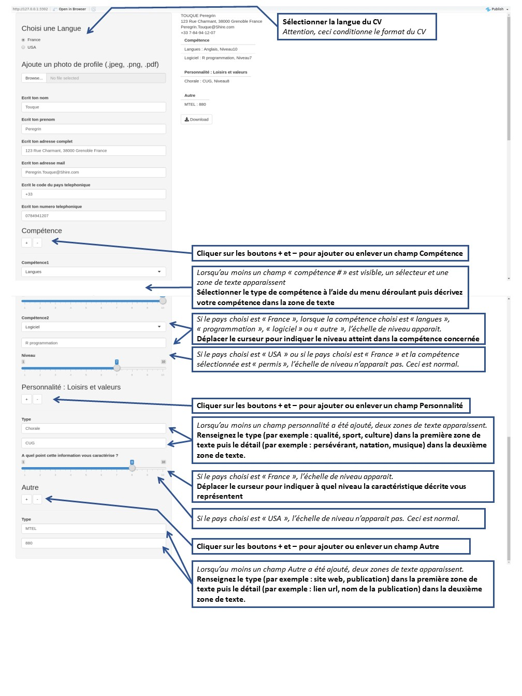

# mode d'emploi de l'appli
## Utilisation

## Exploitation et maintenance

# déroulement du projet 

## Choix du sujet

Nous avons eu beaucoup de difficultés à choisir un sujet. Plusieurs idées ont été proposées. Par exemple, nous avions envisagé d'analyser des données open sources mises à disposition par la ville de Grenoble. Finalement nous avons éliminé ces idées car il semblait que, soit la récolte des données risquait d'être trop longue à mettre en oeuvre, soit le sujet ne laissait pas suffisemment d'opportunité de démontrer les capacités de R en mode developpeur. 

Etant en phase de recherche de stage, nous avons remarqué que, d'un pays à l'autre, le format du CV n'était pas le même. Par exemple, le CV américain est sobre, contenant des listes et du texte, alors que le CV Français est souvent plus édulcoré avec par exemple des graphiques. Nous avons donc perçu la possibilité d'utiliser à la fois :
<ul>
- Shiny pour créer une interface utilisateur avec différents widgets pour chacune des catégories du CV, 
- Markdown pour créer une sortie html du CV,
- ggplot2 pour créer des graphiques, 
- la programmation S3 pour traiter différement les données entrées par l'utilisateur selon le type de sortie choisie.
</ul>

## Répartition des taches

Afin de pouvoir collaborer à distance, nous avons défini deux phases de développement : 
<ul>
- interface utilisateur Shiny
- sortie html, programmation S3, package
</ul>

Dans un premier temps, nous nous sommes réparti le travail de développement de l'interface Shiny en fonction des sections du CV :
<ul>
- Kevin : titre, informations personnelles et photo
- Billy : objectif, expérience professionnelle, formation
- Fanny : compétences, centres d'intéret, autres
</ul>

Nous avons donc chacun travaillé sur notre propre application Shiny afin que chacun puisse debeuguer son application sans être perturbé ou perturber l'application des autres.

Nous avions initialement prévu de rassembler les trois parties Shiny avant de répartir le travail sur la partie Markdown. Cependant, un décalage au sein de l'équipe s'est créé. Nous avons donc adapté notre organisation. Pour permettre à celui qui en avait besoin, de prendre le temps de résourdre ses difficultés, les autres ont avancé sur des sujets de leur initiative à partir des parties Shiny qui avaient pu être finalisées. Ainsi, la suite du développement s'est organisé comme suit :
<ul>
- Kevin : création du package, alimentation du package avec les fonctions et dataframes créés par chacun, gestion des versions du package avec github, rédaction des parties titre, informations personnelles et photo de la sortie html du CV
- Billy : poursuite de la programmation des parties objectif, expérience professionnelle, formation de l'interface Shiny
- Fanny : création de la partie markdown, programmation du transfert d'informations entre shiny et markdown, programmation S3 pour gérer l'affichage des sections en fonction du pays, rédaction des parties compétences, centres d'intérets, autres de la sortie html du CV.
</ul>

# Développement 

## Traduction

Pour gérer le fait que certains éléments de l'application (label et liste de choix) et les outputs soient mis à jour en fonction du pays choisi, nous avons utilisé :
<ul>
- le dataframe : la valeur selectionnée dependant du nom de la colonne, identifiée par le nom du pays ou par une fonction reactive (language) qui prend le nom du pays, et de la ligne, identifiée par le nom ou par l'index du ligne de la composante à traduire
 
> <cite> mise a jour du titre de la catégorie "skills" en fonction du pays choisi </cite>
 
> output$skillsTitle<-renderText({paste(cat["skills",input$Langue])})
 
> textInput("nom", label = paysdf[[language()]][2], value = paysdf[[language()]][9])

</ul>

## Widgets

Sous Shiny, il y a plein de différent widgets qu'on peut utiliser avec des fonctions assez varié. Comme on faisait un formulaire, on a utiliser beaucoup textInput, mais on a aussi utilisé les fileInput, radioButton, actionButton, et sliderInput.  Le facon qu'on a utilisé les widgets, était aussi varié.  On avait quelques-unes qui étaient appeler directement dans le UI, d'autres qui étaient premièrement appeler dans le UI mais la plupart du code était sur le coté serveur, et finalement d'autres qui étaient appeler dans les conditions. 

## Condition

Sous Shiny, une condition peut être codée de différentes manières :
<ul>
- conditional panel : permet de faire apparaitre ou non des widgets en fonction d'une condition calculée dans le server
- observeEvent + update...Input : permet de mettre à jour les paramètres d'un widget de manière réactif, c'est à dire en fonction d'action de l'utilisateur (modification de la valeur d'un input)
- render... ou reactive : Reactive met à jour une variable en fonction d'input. Cette variable peut ensuite être utilisée dans un render... qui peut ensuite être utilisée dans un widget
 
> language<-reactive({switch(input\$Langue,"France" ="France", "USA" = "USA")})
 
> output$Ynom<-renderUI({textInput("nom", label =paysdf[[language()]][2], value = paysdf[[language()]][9])})

- if/else: permet de vérifier si un input est satisfaisant pour ce qui est demandé.  Par exemple, pour numéro, si le input n'a pas une longueur de 10 chiffres, ou qu'il y a un non-chiffre, un message d'erreur est retourné.  

</ul>

## Répétition d'une instruction

Pour répéter une instruction, nous sommes habitué à utiliser une boucle for ou while. Pour Shiny, nous avons trouvé qu'il était plus facile d'utiliser un fonction lapply. On a aussi crée quelque fonction pour faire que le code est moins lourde et moins répétitive.

## Programmation S3

R offre la possibilité de faire de la programmation orienté objet. Dans notre cas, nous avons choisi d'utiliser cet outil pour créer des objets CV.FR et CV.US. C'est deux objets ont un constructeur commun : as.CV.categorie qui va les mettre dans un format plus facile à exploiter pour les methodes ainsi que de mettre à jour leur attribu "class". Deux fonctions "is.CV.FR" et "is.CV.US" permettent de vérifier qu'une variable est de type CV.FR ou CV.US. Enfin, une méthode "show" permet de créer des visualisations en fonction de la classe de l'objet et d'une option choisi dans le cas d'un objet CV.FR.

# Piste d'amélioration 

## Utilisation R shiny

Nous avons remarqué que l'application mettait un certain temps à s'initialiser. Cela est peut être du au fait que Shiny n'est peut être pas adapté pour créer un formulaire. Shiny est peut être plutot adapté pour afficher des résultats avec un nombre d'interactions utilisateur limité. Cependant, nous envisageons des piste d'amélioration :
- Passer par une programmation RCPP permettrait peut être d'optimiser le code

 
## Gestion de projet différente

Nous avons utiliser Rstudio pour tout nos codes, Github pour le stockage et versioning du package, et discord pour le partage de codes et pour la communication.  

Débutant avec l'utilisation de Git et Github, nous avons utilisé cet outil tardivement. Nous aurions pu utiliser Github pour tout le projet et pour le partage du code mais aurait risqué de rendre le code plus long a débeuguer. Cependant, développer un programme commun plutot que de fractionner le travail aurait eu l'avantage de créer une base commune pour rendre le code plus cohérent (utilisation des mêmes solutions au problème commun comme la traduction des champs en fonction du pays choisi).
 
## Ajout de fonctionnalités

### Autres de visualisations

Les limites de l'interface Shiny ayant été atteintes, nous avons été également limité dans l'exploitation des données de sortie. Nous avions initialement mis en place d'autres visualisations plus pertinentes pour une quantité de des données supérieures. Par exemple, si le nombre de champs remplis était supérieur à 15, un wordcloud, dans lequel la taille du mots était proportionnelle à la valeur selectionnée dans le "slider input", permettait de représenter la personnalité de manière plus lisible qu'un camembert.

### Sauvegarde

Créer un CV est un processus long et itératif. Une piste d'amélioration serait donc de permettre à l'utilisateur de sauvegarder sa saisie pour pouvoir y revenir à un autre moment. Pour cela, nous avions envisagé de créer un second bouton permettant d'exporter les données saisies sous forme de fichier .csv. Cette partie du code a été rédigée. La difficulté de cette fonctionnalité supplémentaire réside en fait dans l'import de ce fichier csv puis la mise à jour des variables.

## Utilisation du mode developpeur de R 

Nous avons prévilégié le mode developpeur en nous concentrant sur l'utilisation de Github, la programmation S3 et le diversification des widget Shiny. Ceci s'est fait au détriment du mode utilisateur. En effet, nous n'avons pas beaucoup utiliser les librairies orientées manipulation de données comme dplyr, tidyverse, lubridate, etc.

Les constructeurs et méthodes S3 pourraient être dans le package afin d'alléger la partie markdown du projet. 

# Conclusion

Finalement nous avons eu plus de difficultés que prevues initialement, particulierement en ce qui concerne le travail de groupe a distance. Par exemple, nous avons perdu du temps à attendre que tout les membres du groupe ait fini la partie Shiny.  

Aussi nous avons également conscience que notre projet n'exploite pas assez le coté statistique pour lequelle R est bien connu mais on etait trop dans notre sujets pour le changer et on avait deja beaucoup de problemes sur ce qu'on faisait pour ajouter autres trucs statistiques.
